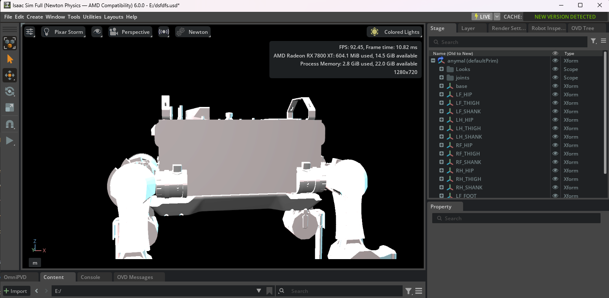

# AMD Ghost Environment

**Version 1.56 — Rust Edition**

**Interoperability middleware that enables CUDA-first AI and rendering software to run
on AMD RDNA hardware — translating CUDA driver calls to HIP at runtime, backed by ZLUDA.**

*"Hardware limitations are just software problems waiting for a translation layer."*

[Join the Discord](https://discord.gg/HvUPDhJQns) ·
[Documentation](https://github.com/Void-Compute/Technical-Docs) ·
[Report an Issue](https://github.com/Void-Compute/AMD-Ghost-Environment/issues)

*Isaac Sim Full (Newton Physics) — live viewport at ~92 FPS on AMD Radeon RX 7800 XT.*

---

## Overview

The AMD Ghost Environment is a runtime interoperability layer for GPGPU acceleration.
It enables software written against the NVIDIA CUDA ecosystem to execute on AMD Radeon
hardware by combining:

- **ZLUDA** — an open-source CUDA-to-HIP translation layer performing the core
  instruction translation
- **Runtime-generated compatibility stubs** — JIT-compiled driver identity and
  library-abstraction components tailored to the detected GPU
- **Environment orchestration** — automated dependency setup, HIP device overrides,
  Python import hooks, and a managed execution shell

The result: applications that require `nvcuda.dll`, query device identity, or refuse to
start without a supported NVIDIA GPU can execute on RDNA hardware, with the AMD GPU
performing the actual computation.

### Current Status

The complete CUDA driver surface — initialization, device enumeration, context
management, memory operations, streams, events, module loading/JIT and kernel launch —
is verified working through the stack. NVIDIA's **Warp 1.13** framework initializes
fully on RDNA hardware via Ghost and compiles kernels at runtime.

**In active research:** full viewport rendering for large CUDA-dependent applications
such as Isaac Sim, via Ghost's alternate rendering path. The architecture analysis and
roadmap are documented in
[Technical-Docs](https://github.com/Void-Compute/Technical-Docs).

---

## Quick Start

> **Requirements:** Windows 10/11, an AMD RDNA or Vega GPU, and elevated execution
> rights (Ghost manages registry configuration and deploys system stubs during setup).
> [Visual Studio Build Tools (C++)](https://visualstudio.microsoft.com/visual-cpp-build-tools/)
> are required for on-the-fly stub compilation; `doctor` verifies this automatically.

1. Download the latest build from the
   [Releases](https://github.com/Void-Compute/AMD-Ghost-Environment/releases) page, or
   build from source.
2. Right-click `ghost_amd.exe` and select **Run as Administrator**.
3. On first launch, Ghost automatically downloads its dependencies (ZLUDA, HIP SDK
   components, compatibility stubs) and detects the installed hardware.

## The Ghost Shell

Once inside the `(ghost amd)>` prompt, the following commands are available:

| Command | Description |
|---|---|
| `run <script.py> [args]` | Launches AI scripts with smart failover and the Waiting Room interface |
| `translate <folder>` | Converts CUDA C++/Python source to native AMD HIP via HIPIFY (Perl) |
| `benchmark` | Measures actual GPU throughput (FP16 / FP32 TFLOPS) |
| `doctor` | Diagnoses the environment: MSVC `cl.exe`, ROCm, drivers, HIP SDK |
| `install-deps` | Manually re-downloads all core Ghost components |
| `clean` | Removes registry configuration and purges the `.ghost` environment |

## The Waiting Room Interface

While large AI models load, Ghost provides a live monitoring interface:

- **Real-time telemetry** — VRAM usage, temperature and GPU load
- **DOOM** — a fully functional DOOM port runnable inside the shell (key: `D`)
- **Background music** — toggleable audio stream (key: `M`)
- Control is returned to the hosted application the moment it opens its local port

## Hardware Support Matrix

Ghost maps detected AMD hardware to the closest NVIDIA compatibility profile so that
application device checks and library heuristics select functional code paths:

| AMD Host Series | Mask Version | Compatibility Profile |
|:--- |:--- |:--- |
| RX 9000 Series | 11.0.0 | GeForce RTX 5090 class |
| RX 7000 Series | 11.0.0 | GeForce RTX 4090 class |
| RX 6000 Series | 10.3.0 | GeForce RTX 3090 Ti class |
| RX 5000 Series | 10.1.0 | GeForce RTX 2080 Ti class |
| Radeon VII / MI50 | 9.0.6 | Tesla V100 class |
| Vega 64 / Vega 56 | 9.0.0 | Tesla P100 class |

For unsupported devices, please open an issue — new compatibility profiles are a
single mapping entry.

---

## Technical Architecture

- **JIT stub generation** — writes and compiles C++ with `cl.exe` at runtime to produce
  an `nvml.dll` abstraction reflecting the detected AMD VRAM configuration and device
  name in memory queries.
- **Smart failover** — applications launch natively via ROCm first for maximum
  performance; on crash or incompatibility, Ghost relaunches the process with the ZLUDA
  translation layer injected.
- **`HSA_OVERRIDE_GFX_VERSION`** — maps unsupported RDNA revisions onto compatible ROCm
  targets so the HIP runtime accepts the hardware.
- **Python import hooks** — a `sitecustomize.py` layer so that `torch.cuda.is_available()`
  reports accurately for stacks probing before initialization.
- **Registry guard** — scopes configuration under `SOFTWARE\NVIDIA Corporation` keys
  with automatic cleanup; the `clean` command removes everything Ghost created.

The complete architecture analysis, design documents and reverse-engineering history
are maintained in
**[Void-Compute/Technical-Docs](https://github.com/Void-Compute/Technical-Docs)**.

---

## Roadmap

| Status | Item |
|:---|:---|
| Completed | Automated ZLUDA integration with smart failover |
| Completed | Interactive Waiting Room interface (telemetry, DOOM, music) |
| Completed | Full Rust rewrite — hardened Windows daemon (registry/WMI hooks) |
| Completed | Ghost shell: `run`, `translate`, `benchmark`, `doctor`, `clean` |
| Completed | Full CUDA driver surface verified on RDNA, including runtime JIT via Warp |
| Completed | CUDA-Vulkan external-memory/semaphore bridge (render-compute sharing) |
| Research | Viewport rendering for CUDA-dependent applications (see Technical-Docs) |
| Research | Community beta-testing program (hardware matrix expansion) |
| WIP | Linux build — not yet at feature parity with the Windows build |

Development is balanced alongside full-time studies; stability is prioritized over
release speed.

---

## Community

- **[Discord](https://discord.gg/HvUPDhJQns)** — updates, support, and the community
  hardware-testing program currently being organized across the RDNA/Vega lineup
- **[Issues](https://github.com/Void-Compute/AMD-Ghost-Environment/issues)** — bug
  reports and hardware requests are welcome; please include GPU model, driver version
  and `ghost_trace.log`
- **[Technical-Docs](https://github.com/Void-Compute/Technical-Docs)** — the complete
  documented history, architecture analysis and planned work

## FAQ

**Does Isaac Sim run on AMD yet?**

Not the full viewport — that is the current research objective (see Technical-Docs).
CUDA *compute* through Isaac Sim's frameworks (e.g. Warp) already executes on RDNA
hardware via Ghost.

**Why are Administrator rights required?**

Ghost performs registry configuration and deploys system-level stubs during setup. All
modifications are reversible via the `clean` command.

**Where did my registry changes go?**

The `clean` command removes all Ghost-managed keys and purges the `.ghost` directory.
Ghost scopes its own configuration and does not modify keys it did not create.

---

## Legal Notice and Trademarks

This is an independent research project. It is **not affiliated with, endorsed by, or
sponsored by NVIDIA Corporation or Advanced Micro Devices, Inc.**

CUDA, NVIDIA, GeForce and Tesla are trademarks of NVIDIA Corporation. ROCm, HIP and
Radeon are trademarks of Advanced Micro Devices, Inc. All other names may be trademarks
of their respective owners. Trademark references describe compatibility relationships
only and imply no endorsement.

This software is provided under the **GNU Affero General Public License v3.0**, without
warranty of any kind. Ghost modifies system configuration (reversible via `clean`);
users are responsible for creating appropriate system backups before use.

---

*Developed to extend the usable capability and lifetime of AMD hardware.*

